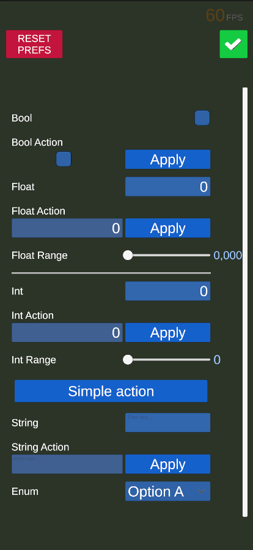

# Knifest-DebugTools



A flexible, extensible in-game debug panel for Unity. Instantly view, edit, and trigger fields and methods at runtime—no code changes required.

---

## Features

- Debug int, float, bool, string, and enum fields
- UnityEvent support for field changes
- Action buttons for methods
- Easy to extend with your own field types
- Minimal, clean UI
- Editor menu integration for quick setup

---


## Installation


1. Copy the package into your Unity project's `Packages` or `Assets` folder.

---


## How to Use


### 1. Add the Debug Panel

- Use the Unity menu: `Knifest > Add DebugTools`, or right-click in the Hierarchy and select `Knifest > Add DebugTools`.
- If a GameObject is selected, the debug panel will be added as its child.

### 2. Modify the Debug Panel

- Open the container: `Knifest > Open Container`.
- In the Hierarchy, find `-- CONTAINER -- (Edit here)`.
- Open the prefab folder: `Knifest > Open Prefab Folder`.
- Drag & drop field prefabs into the container for any type you need.
- Select a field to edit its Label, Default Value, and link methods/properties to UnityEvents in the Inspector.
- When finished editing, close the container using `Knifest > Close Container`.

### 3. Play and Debug

- Enter Play mode. In the running game, look for the debug tools button (see icon below) in the corner of the screen.

  
- Click this button to open or close the debug panel at runtime.
- Use the debug panel to tweak values, trigger actions, and monitor changes in real time.

---

## Enum Debug Fields

Knifest-DebugTools makes it easy to debug enum fields with a dropdown and UnityEvent callback.

**How to add an enum debug field:**

1. Create a class that inherits from `EnumDebugFieldInstruction<YourEnumType>` (see example below).
2. Add a prefab of Enum Debug Field to the container, following the instructions above.
3. In the Inspector, click the field named **Instruction** and select your custom instruction type from the dropdown (it will list all types that implement `IEnumDebugFieldInstruction`).
4. The dropdown in the debug panel will automatically show all values of your enum.
5. You can now assign UnityEvent callbacks that are strongly typed to your enum type.

**Example:**

Suppose you have an enum:
```csharp
public enum GameState { Menu, Playing, Paused, GameOver }
```

Create an instruction:
```csharp
[Serializable]
public class GameStateDebugFieldInstruction : EnumDebugFieldInstruction<GameState> { }
```

Assign this instruction to your Enum Debug Field in the inspector.  
Now, when you select a value from the dropdown, the UnityEvent will fire with the selected enum value.

---

## Editor Menu

- **Add DebugTools**: Quickly add the debug panel prefab to your scene.
- **Open/Close Container**: Focus and expand/collapse the debug panel in the hierarchy.
- **Open Prefab Folder**: Jump to the folder with field prefabs for easy customization.

---

## Roadmap / TODO

- [ ] Curve debug
- [ ] Get default value from field
- [ ] Support horizontal screen
- [ ] Advanced DropDown improvements

---

**Knifest-DebugTools**: The easy, extensible way to debug your Unity games in real time.